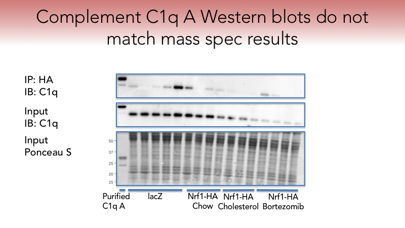

[GitHub](https://github.com/br3ndonland/R-proteomics-Nrf1)

Affinity purification-mass spectrometry to identify the Nrf1 protein complex

## Intro

This is a summary report of an experiment I performed during my postdoc. The goal of this experiment was to identify a [molecular](https://www.khanacademy.org/science/biology/macromolecules) complex associated with Nrf1, a protein molecule our research group was studying. Nrf1 is also abbreviated NFE2L1, and should not be confused with Nuclear Respiratory Factor 1.

We began studying Nrf1 because it resides on a [cellular organelle](https://youtu.be/URUJD5NEXC8) called the Endoplasmic Reticulum (ER). We study the ER and its roles in [metabolism](http://learn.genetics.utah.edu/content/metabolism/). We found that Nrf1 mediates the cellular response to cholesterol, and that it seemed to do this separately from its known function as a genetic transcription factor in the nucleus. Cholesterol metabolism occurs at the ER, and is very important in the liver, where cholesterol is metabolized and prepared for excretion. 

We hypothesize that a group of other proteins interacts with Nrf1 to mediate its response to cholesterol at the ER. We used proteomics to test our hypothesis, which identifies all possible proteins in a sample with a technique called mass spectrometry.

## Methods


### Adenovirus

To study the Nrf1 protein complex in the context of liver tissue, we first needed to introduce a tagged form of Nrf1. A tag is a small number of additional amino acids used to more easily isolate and analyze the protein. We used a C-terminal HA tag (YPYDVPDYA).

We used adenovirus to introduce the HA-tagged Nrf1 gene into mouse liver. The genetic material carried by the virus is incorporated into the mouse genome, and the protein is then produced by liver cells. We used a lacZ adenovirus as a negative control, which is a gene in the lac operon that encodes the beta-galactosidase protein. 

Mice were handled in compliance with all ethical guidelines.

### Diets and treatments

We then fed the mice their standard chow diet, or a Paigen diet which contains additional ingredients to promote accumulation of cholesterol in the liver. We also had a group of mice that received treatment with the drug Bortezomib, as a positive control for Nrf1 activation. Bortezomib is a pharmaceutical compound known to activate the genetic transcriptional functions of Nrf1 by inhibiting the proteasome. 

### Liver ER fraction and HA IP

We enriched the microsomal fraction (containing ER, where Nrf1 resides) from mouse liver lysates.


The Western blots display protein markers of different [cellular compartments](http://learn.genetics.utah.edu/content/cells/):

- Na K ATPase is a plasma membrane protein.
- Histone H3 is a nuclear protein that interacts with DNA.
- Lamin A/C are nuclear membrane proteins.
- COX IV is a mitochondrial protein.
- Calreticulin is an ER protein.
- Ponceau S is a total protein stain, used to show equal loading in all lanes.

The three lanes on the left are control samples: 

- Lane 1: Nrf1 knockout mouse embryonic fibroblast ("KO" MEF) whole cell lysate. Negative control for presence of Nrf1.
- Lanes 2-3: HEK-293 cells ("293") are a commonly used immortalized human cell line (the cells continuously grow and divide in the lab). We used HEK-293 cells in this experiment as controls for Nrf1 and cellular compartments, and to evaluate antibody reactivity with human and mouse samples. The cells stably expressed Nrf1-HA, were treated with Epoxomycin ("Epoxo") to activate Nrf1, and were fractionated into microsomal ("M") or nuclear ("N") fractions.  There is less total protein in the microsomal fraction (lane 2), because HEK-293 cells only yield small amounts of ER, but it is still useful as a qualitative comparison.

Nrf1 was measured, and is shown in the top row. As expected, samples from mice given the adenovirus had more Nrf1. The controls on the left were present on the same Western blot as the microsomal input samples, but a separate image from a shorter blot development exposure is shown because of the extremely strong signal.

**The Western blots demonstrate that the samples are enriched in microsomal proteins, and essentially free of nuclear proteins, but retain proteins from  other membrane fractions.**

### Immunoprecipitation

Immediately after enriching the samples for the microsomal fraction, we isolated Nrf1 by immunoprecipitation (IP) for the HA tag. We used standard reagents and procedures from ThermoFisher.

Further details can be found in the [IP protocol](data-supplementary/BWS-IP-protocol-HA.docx) and [electronic lab notebook entry](data-supplementary/R-proteomics-Nrf1-Labguru.pdf).

### Mass spectrometry

We then worked with the ThermoFisher Center for Multiplexed Proteomics (TCMP) to perform quantitative multiplexed proteomic mass spectrometry analysis on the liver samples. The combination of immunoprecipitation (a type of affinity purification) and mass spectrometry is referred to as affinity purification-mass spectrometry (AP-MS).

- We provided our samples to TCMP in IP elution buffer.
- Gel
  - The TCMP does a brief gel cleanup before mass spectrometry. Ryan claims this is helpful because the gel is agnostic to the elution buffer used to obtain the sample. However, a high protein concentration is required because of the small gel loading volume.
  - After mass tagging, they then also do a 3 hour column separation prior to MS.
  - If samples are divided among multiple runs (as ours were), include an internal “mix” standard for comparison. This is basically a small amount (5 μL) of all the samples mixed together.
  - 30 μL of each sample was then loaded into a 10% Bis-Tris gel and run at 120V for 12 minutes.
  - Gels were stained for 2 hours with Coomassie and destained overnight in water.
  - Additional gels were run and stained with the remaining sample.
  - Gel bands were cut out, destained, reduced and alkylated.
- Enzyme digestion
  - In-gel trypsin digestion was performed.
- Tandem Mass Tagging
  - Tandem Mass Tags (TMTs) are used to label primary amine groups.
  - Ten different tags are available, allowing ten samples in the same mass spectrometry run.
  - The tags are isobaric, meaning that they elute at the same time during LC, and have the same mass during MS1 acquisition, but after MS2 peptide sequencing, they fragment into unique ion masses during MS3 reporter ion quantification.
- Mass spectrometry
  - Peptides were resuspended in 5% Acetonitrile, 5% formic acid.
  - Peptides were separated using a gradient of 6 to 28% acetonitrile in 0.125% formic acid over 180 minutes.
  - Half of the sample was shot on an Orbitrap fusion tribrid mass spectrometer.

Further details can be found in the [Mass spectrometry protocol](data-supplementary/BWS-proteomics-protocol.docx) and [electronic lab notebook entry](data-supplementary/R-proteomics-Nrf1-Labguru.pdf).

We received our results on March 16, 2016.

### Data processing

<!-- TODO: re-do the data manipulation completely in R -->

#### TCMP data analysis

- MS2 spectra were searched using the SEQUEST algorithm against a Uniprot composite database derived from the mouse proteome containing its reversed complement and known contaminants.
- Peptide spectral matches were filtered to a 1% false discovery rate (FDR) using the target-decoy strategy, for determination of incorrectly identified proteins, combined with linear discriminant analysis.
- Proteins were quantified only from peptides with a summed signal to noise (SN) threshold of ≥200 and MS2 isolation specificity of 0.5, and do not include contaminants or reverse hits.
- The TCMP provided an Excel workbook containing peptide counts (not sure if they are unique or total peptides), absolute and relative abundances of all proteins identified in the samples, and a PowerPoint report with methods and preliminary data analysis (hierarchical clustering performed in GENE-E, see below). They typically do not provide further assistance with data analysis. 

#### My data analysis

There is no standardized way to analyze this type of mass spectrometry data, so I developed a custom data analysis pipeline. 

I was provided with the results in a Microsoft Excel workbook, so I performed some initial data preparation there for simplicity.

The steps I performed were:

- **Normalization**
  - To compare results across multiple runs, I divided total summed signal to noise (or normalized relative abundance) for each sample by the corresponding value for the mix standard within that run.
  - Note that this creates a ratio, and log2 transformation should be performed before further analysis.
- **Filtration**
  - I filtered the hit list to exclude proteins with ≤2 peptides quantified in all runs.
  - Including only proteins with ≥2 peptides means the identification of the protein itself is confident, because multiple peptides corresponding to it have been identified, and that the identification of the protein is repeatable, because ≥2 peptides were detected in each mass spectrometry run. 
- **Transformation**
  - I used log2 transformation.
  - ∆Cholesterol=log2((HA chol/mix)/(HA cont/mix))-log2((HA cont/mix)/(lacZ/mix))
- **Background subtraction**
  - Background subtraction was not effective in these samples because protein abundance was greater in lacZ than HA in many cases. 
  - Proteins with an HA fold change (HA cont/mix)/(lacZ/mix)<1 could be excluded (meaning that the proteins were higher abundance in lacZ samples, without the tag we were pulling down). I kept them in for this analysis.
- **T-tests**
  - A fold change of 1.5 (log2=0.58) is commonly used as a threshold for biological significance.
  - 33 proteins had ∆Cholesterol>0.58.
  - T-tests were performed in Excel for convenience: `=TTEST(group1,group2,tails,type)`
  - Data were sorted ascending to see significant hits.
  - Significant hits were highlighted with conditional formatting.
  - I performed ANOVA in R on the untransformed total summed signal to noise/mix values for all the significant hits. See [supplementary data](data-supplementary/R).

Further details can be found in the [Mass spectrometry protocol](data-supplementary/BWS-proteomics-protocol.docx) and [electronic lab notebook entry](data-supplementary/R-proteomics-Nrf1-Labguru.pdf).

After normalization, filtration, transformation, background subtraction, and t-tests in Excel, I performed additional statistical analysis and plotting in R.

## Results

**Complement C1q proteins were identified as potentially interacting with Nrf1.**

### R data import

```{r proteomics-01-import}
proteomics_data <-
  read.table("data/R-proteomics-Nrf1.csv",
             header = TRUE,
             sep = ",")
attach(proteomics_data)
```

### Volcano plots

- Each point is a protein.
    - Red if p<0.05 for the comparison shown
    - Orange if [log2 fold change]>1
    - Green if both
- log2 transformation is used to normalize positive and negative fold changes.
- -log10(pvalue) is used so p values can be plotted as whole numbers. 
- Note that I was not able to separate each code section into different R markdown code chunks. I needed the generation of points to be continuous with generation of the original plot. 
- I based my volcano plots on the example from [Getting Genetics Done](http://www.gettinggeneticsdone.com/2014/05/r-volcano-plots-to-visualize-rnaseq-microarray.html).

#### HA cholesterol plot

This plot compares chow-fed mice with mice fed the Paigen diet to promote accumulation of cholesterol in the liver, and demonstrates the increased abundance of Complement C1qA, C1qB, and C1qC, in mice fed the Paigen diet.

```{r proteomics-02-plot-hachol}
# bold axis titles

par(font.lab = 2)

# create plot
with(
  proteomics_data,
  plot(
    log2_FC_HAchol_HAchow,-log10(pvalue),
    pch = 20,
    xlim = c(-2, 2),
    ylim = c(0, 3),
    yaxp = c(0, 3, 3),
    main = "Cholesterol-induced Nrf1 interacting proteins",
    xlab = "log2(FC HA chol/HA chow)",
    ylab = "-log10(pvalue HA chol vs HA chow)"
  )
)

# Add colored points:
# red if pvalue<0.05, orange if [log2FC]>1, green if both)
with(
  subset(proteomics_data, pvalue < .05),
  points(
    log2_FC_HAchol_HAchow,-log10(pvalue),
    pch = 20,
    col = "red"
  )
)

with(
  subset(proteomics_data, abs(log2_FC_HAchol_HAchow) > 1),
  points(
    log2_FC_HAchol_HAchow,-log10(pvalue),
    pch = 20,
    col = "orange"
  )
)

with(
  subset(proteomics_data, pvalue < .05 &
           abs(log2_FC_HAchol_HAchow) > 1),
  points(
    log2_FC_HAchol_HAchow,-log10(pvalue),
    pch = 20,
    col = "green"
  )
)

# Label points with the textxy function from the calibrate package
library(calibrate)
with(
  subset(proteomics_data, pvalue < .05 &
           abs(log2_FC_HAchol_HAchow) > 1),
  textxy(
    log2_FC_HAchol_HAchow,-log10(pvalue),
    labs = Gene,
    cex = 1
  )
)

```

#### HA Bortezomib plot

Bortezomib treatment alters the proteome. 

```{r proteomics-02-plot-habort}
# bold axis titles
par(font.lab = 2)

# create plot
with(
  proteomics_data,
  plot(
    log2_FC_HAbort_HAchow,-log10(pvaluebort),
    pch = 20,
    xlim = c(-3, 3),
    ylim = c(0, 4),
    main = "Nrf1 AP-MS volcano plot Bortezomib vs chow",
    xlab = "log2(FC HA bort/HA chow)",
    ylab = "-log10(pvalue HA bort vs HA chow)"
  )
)
# Add colored points:
# red if pvalue<0.05, orange if log2FC>1, green if both)
with(
  subset(proteomics_data, pvaluebort < .05),
  points(
    log2_FC_HAbort_HAchow,-log10(pvaluebort),
    pch = 20,
    col = "red"
  )
)

with(
  subset(proteomics_data, abs(log2_FC_HAbort_HAchow) > 1),
  points(
    log2_FC_HAbort_HAchow,-log10(pvaluebort),
    pch = 20,
    col = "orange"
  )
)

with(
  subset(
    proteomics_data,
    pvaluebort < .05 & abs(log2_FC_HAbort_HAchow) > 1
  ),
  points(
    log2_FC_HAbort_HAchow,-log10(pvaluebort),
    pch = 20,
    col = "green"
  )
)

# Label points with the textxy function from the calibrate package
library(calibrate)
with(
  subset(
    proteomics_data,
    pvaluebort < .05 & abs(log2_FC_HAbort_HAchow) > 1
  ),
  textxy(
    log2_FC_HAbort_HAchow,-log10(pvaluebort),
    labs = Gene,
    cex = 1
  )
)

```

#### HA vs lacZ plot

The proteome was not significantly different with or without the HA tag, indicating issues with the HA immunoprecipitation. Note that the code for labeling points appears to be separated from the rest of the code for the plot, possibly because there were no points labeled.

```{r proteomics-02-plot-halacz}
# bold axis titles
par(font.lab = 2)

# create plot
with(
  proteomics_data,
  plot(
    log2_FC_HAchow_lacZ,-log10(pvaluechow),
    pch = 20,
    xlim = c(-2, 2),
    ylim = c(0, 3),
    yaxp = c(0, 3, 3),
    main = "Nrf1 AP-MS volcano plot HA vs lacZ",
    xlab = "log2(FC HA chow/lacZ chow)",
    ylab = "-log10(pvalue HA chow vs lacZ chow)"
  )
)

# Add colored points:
# red if pvalue<0.05, orange if [log2FC]>1, green if both)
with(
  subset(proteomics_data, pvaluechow < .05),
  points(
    log2_FC_HAchow_lacZ,-log10(pvaluechow),
    pch = 20,
    col = "red"
  )
)

with(
  subset(proteomics_data, abs(log2_FC_HAchow_lacZ) > 1),
  points(
    log2_FC_HAchow_lacZ,-log10(pvaluechow),
    pch = 20,
    col = "orange"
  )
)

with(
  subset(proteomics_data, pvaluechow < .05 &
           abs(log2_FC_HAchow_lacZ) > 1),
  points(
    log2_FC_HAchow_lacZ,-log10(pvaluechow),
    pch = 20,
    col = "green"
  )
)

# Label points with the textxy function from the calibrate package
library(calibrate)
with(
  subset(proteomics_data, pvaluechow < .05 &
           abs(log2_FC_HAchow_lacZ) > 1),
  textxy(
    log2_FC_HAchow_lacZ,-log10(pvaluechow),
    labs = Gene,
    cex = 1
  )
)

```

### Scatter plot

The scatter plot is an interesting way to visualize two between-group comparisons, but the volcano plot is more useful for this dataset.

To set size of points according to p value:

```
dotsize <- -log10(pvalue)
head(dotsize)
```

then put `cex=dotsize` inside the `plot()` and `points()` functions.

```{r proteomics-02-plot-scatter}
# set size of points according to p value
dotsize <- -log10(pvalue)

# bold axis titles
par(font.lab = 2)

# create plot
with(
  proteomics_data,
  plot(
    log2_FC_HAchol_HAchow,
    log2_FC_HAbort_HAchow,
    pch = 20,
    main = "Nrf1 AP-MS scatter plot",
    xlab = "log2(FC HA chol/HA chow)",
    ylab = "log2(FC HA bort/HA chow)",
    cex = dotsize
  )
)

# Label points with the textxy function from the calibrate package
library(calibrate)
with(
  subset(proteomics_data, pvalue < .05 &
           abs(log2_FC_HAchol_HAchow) > 1),
  textxy(log2_FC_HAchol_HAchow,
         log2_FC_HAbort_HAchow,
         labs = Gene)
)

```

## Limitations


- We got low and inconsistent protein pulldown with the HA tag immunoprecipitation, and as a result, the proteome was basically the same with (Nrf1-HA adenovirus) or without (lacZ adenovirus) the tagged protein. See HA vs lacZ plot.
- Cluster analysis in Morpheus revealed that the samples did not cluster by treatment group as expected.
- The mass spec core facility required us to elute the protein from the agarose immunoprecipitation beads, and then ran the samples on gels, which introduces variability and requires a higher protein concentration than we were able to provide in our samples. They also had a slow turnaround time, taking over two months to analyze the samples.




I was not able to clearly validate the C1q mass spectrometry findings with Western blot.


## Future plans


- We developed an immunoprecipitation method for Nrf1 directly, instead of for the HA tag, so we can work with Nrf1 liver knockout mice and do not have to infect mice with Nrf1-HA adenovirus for the experiments. We plan to analyze livers with or without Nrf1 (Nrf1 flox Albumin Cre), with and without cholesterol diet, in order to identify cholesterol-responsive Nrf1 interacting proteins.
- We switched to a different mass spectrometry core with a quicker turnaround time, and where we did not need to elute proteins from the beads or run gels. 

## Resources

Supplementary data, including the electronic lab notebook, raw data, other data analyses, and PowerPoint slides, are available in the [data-supplementary](data-supplementary) sub-directory of this repository.
