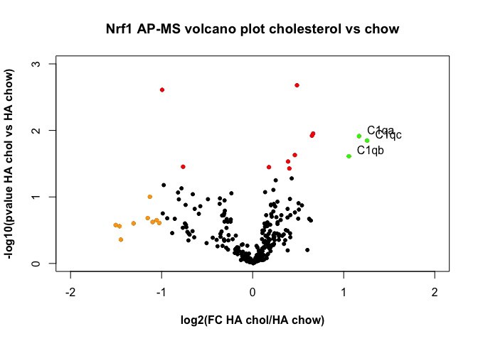

# README

R proteomics analysis

Affinity purification-mass spectrometry to identify the Nrf1 protein complex

Brendon Smith

br3ndonland

## Table of Contents

- [Table of Contents](#table-of-contents)
- [Introduction](#introduction)
- [Description](#description)
  - [R Markdown](#r-markdown)
  - [Jupyter Notebook](#jupyter-notebook)
- [Instructions](#instructions)
- [Results](#results)

## Introduction

This is a summary report of an experiment I performed during my postdoc. The goal of this experiment was to identify a [molecular](https://www.khanacademy.org/science/biology/macromolecules) complex associated with Nrf1, a protein we were studying.

We began studying Nrf1 because it resides in a [cellular organelle](https://youtu.be/URUJD5NEXC8) called the Endoplasmic Reticulum (ER). We study the ER and its roles in [metabolism](http://learn.genetics.utah.edu/content/metabolism/). We found that Nrf1 mediates the cellular response to cholesterol, and that it seemed to do this separately from its known function as a genetic transcription factor in the nucleus. Cholesterol metabolism occurs at the ER, and is very important in the liver, where cholesterol is metabolized and prepared for excretion.

We hypothesize that a group of other proteins interacts with Nrf1 to mediate its response to cholesterol at the ER. We used proteomics to test our hypothesis, which identifies all possible proteins in a sample with a technique called mass spectrometry.

## Description

Analyses were performed with the R computing language, and are provided in [R Markdown](http://rmarkdown.rstudio.com/) and [Jupyter Notebook](http://jupyter.org/documentation) formats.

### R Markdown

- [R Markdown](http://rmarkdown.rstudio.com/) is a document creation package based on [Markdown](https://www.markdownguide.org/) (syntax for easy generation of formatted HTML documentation), [knitr](http://yihui.name/knitr/) (report generation package) and [pandoc](http://johnmacfarlane.net/pandoc/) (universal document converter).
- An RMarkdown file contains three types of data: YAML front matter header at the top of the file to specify output methods, Markdown-formatted text, and functional code chunks.
- I use [RStudio](https://www.rstudio.com/), installed via [Anaconda](https://www.anaconda.com/), to work with R Markdown. I created an [RStudio project](https://support.rstudio.com/hc/en-us/articles/200526207-Using-Projects), which is required for version control and package management.
- [Packrat](https://rstudio.github.io/packrat/) was used to manage R packages for the project. [Packrat works with RStudio](https://rstudio.github.io/packrat/rstudio.html) and gives each project its own private package library. R is heavily dependent on its package ecosystem, and Packrat helps avoid problems caused by different package versions and installations.

### Jupyter Notebook

- Jupyter Notebook files are run in JupyterLab, which is installed by default with Anaconda. JupyterLab was previously Jupyter Notebook.
- [JupyterLab](http://jupyterlab.readthedocs.io/en/latest/) is produced by [Project Jupyter](http://jupyter.org/). It is most widely used for scientific computing with Python, but supports many programming languages, including R.
- Jupyter Notebook files enable creation of "reproducible computational narratives" containing Markdown text interspersed with functional code chunks that will run and display output.

## Instructions

- Install [Anaconda](https://www.anaconda.com/) (including Python and JupyterLab by default). I install Anaconda by direct download, instead of from a Homebrew Cask, for proper configuration of the command prompt.
- Install R and R essentials from the command line:

  ```bash
  $ conda install -c r r-essentials
  ```

- Install RStudio from the command line:

  ```bash
  $ conda install rstudio
  ```

- Fork and clone this repository.
- Open [R-proteomics-Nrf1.Rproj](R-proteomics-Nrf1.Rproj), or open RStudio and select "Open project."
- Click "Knit." RStudio will run the code, installing packages locally with Packrat, and will then present R Markdown output.

## Results



Complement C1q proteins were identified as potentially interacting with Nrf1 in the setting of liver cholesterol accumulation. The experiment did have notable limitations, which prompted us to refine our methods and continue with further experiments.

[(Back to TOC)](#table-of-contents)